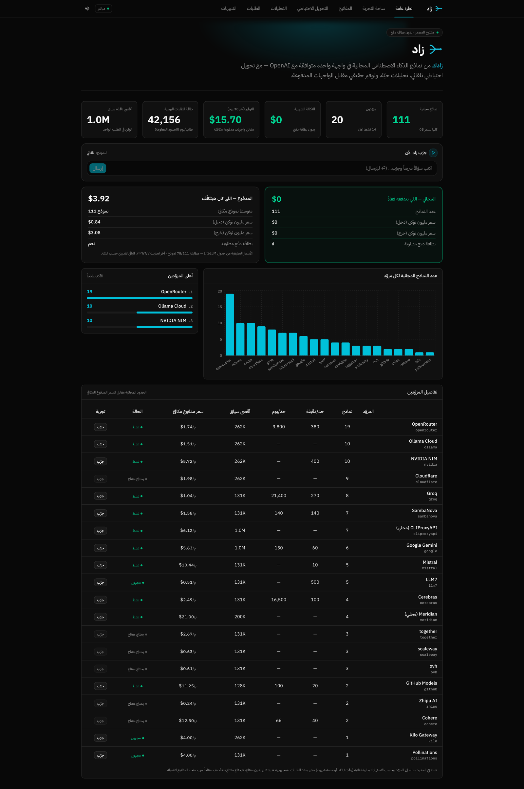
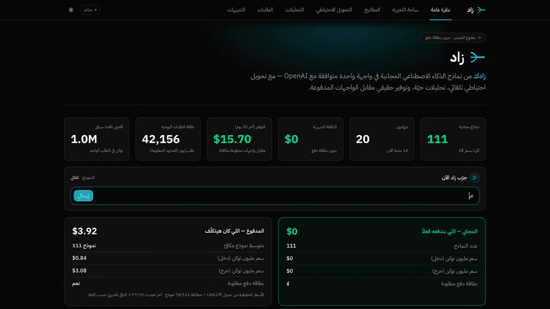
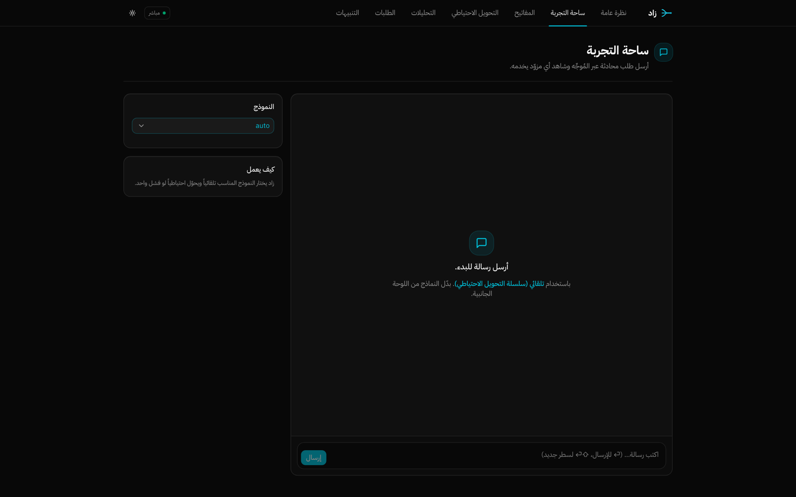
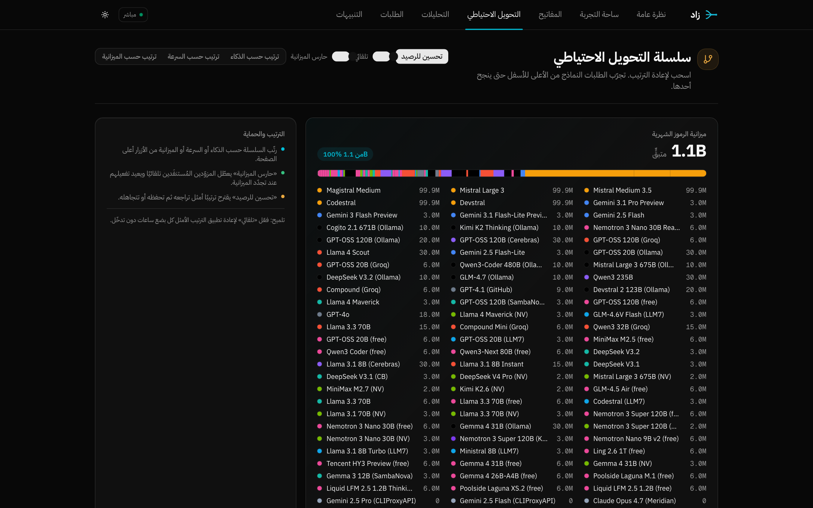
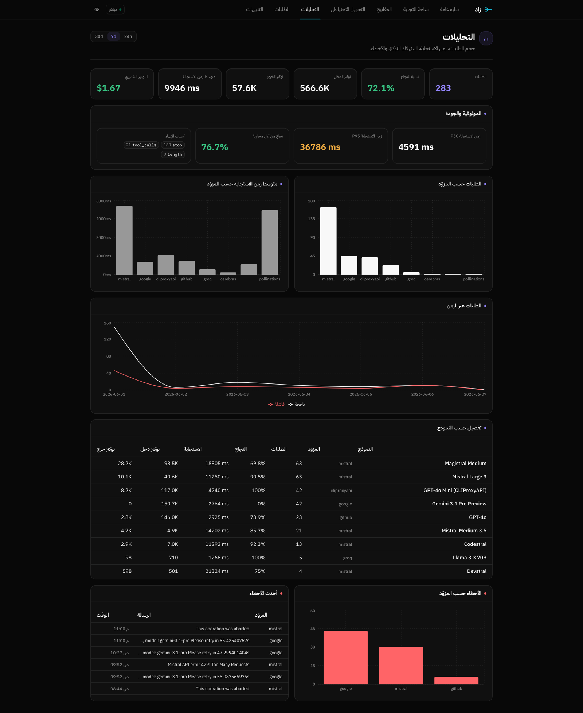
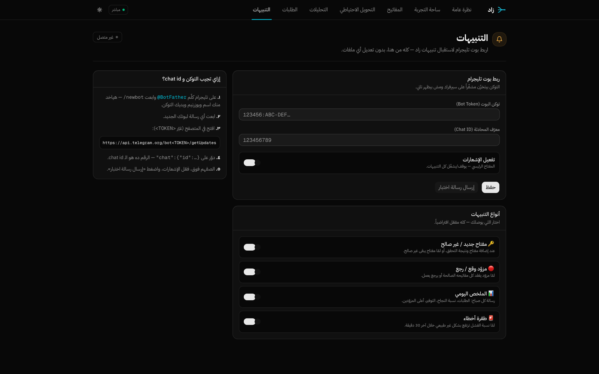
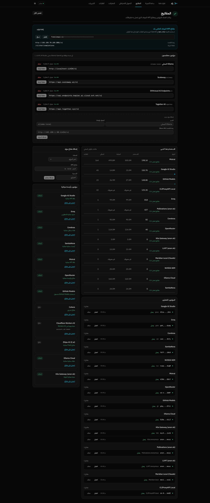
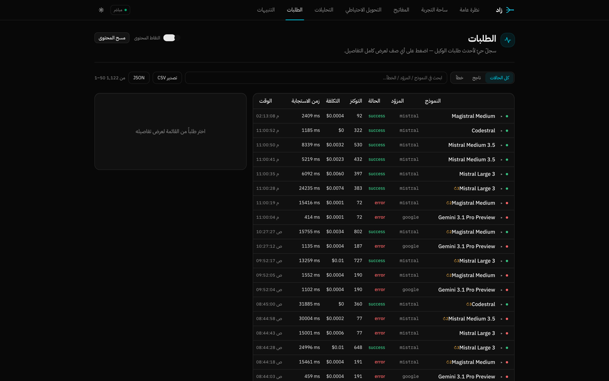

<div align="center">

# زاد · Zad

**One OpenAI-compatible endpoint over the free tiers of 17+ AI providers — self-hosted, Arabic-first.**

**موجّه واحد متوافق مع OpenAI يجمع نماذج الذكاء الاصطناعي المجانية من 17+ مزوّداً.**

[](./LICENSE)
[](https://demo.zad.tools)
[](https://zad.tools)
[](#-contributing--المساهمة)


🌐 **[zad.tools](https://zad.tools)** · 🧪 **[Live demo · demo.zad.tools](https://demo.zad.tools)** · ⭐ **[GitHub](https://github.com/ahmedvnabil/zad)**

🇬🇧 [**English**](#-zad--english) · 🇸🇦 [**العربية**](#-زاد--العربية)



</div>

---

## 🌍 Zad · English

Dozens of excellent free AI models exist — but they're scattered across 17+ providers, each with its own limits, error semantics, and API key. **Zad** unifies them all behind a single OpenAI-compatible endpoint (`/v1/chat/completions`), picks the right model for each request, and automatically falls back when a provider rate-limits or goes down — all behind one key.

Fully self-hosted: **keys encrypted on your server, data never leaves the building, no monthly bill.**

<div align="center">



🎬 **[Watch the full demo (MP4)](docs/demo.mp4)**

</div>

### 💰 Why it matters — real numbers

For a workload of ~50,000 chat requests/month (~2k tokens each):

| Provider | Monthly cost |
|---|---|
| Claude Sonnet 4.5 | $1,100 |
| GPT-4o | $1,167 |
| Gemini 2.5 Pro | $708 |
| **Zad (free tiers + self-hosted)** | **$0** |

Same models. Same quality. Different plumbing. The free tiers carrying that $0 are not toys — Cerebras (1k req/day, sub-second), Groq (1k/day), Gemini (1M-token context), NVIDIA, Mistral, Cohere, SambaNova. Together they comfortably absorb most apps.

### ✨ Features

- 🔌 **OpenAI-compatible** — swap `base_url`, any SDK or tool works immediately.
- 🌊 **17+ providers · 100+ free models** behind one key (Groq · Cerebras · SambaNova · NVIDIA · Mistral · OpenRouter · GitHub Models · Cohere · Cloudflare · Google · Zhipu · Ollama Cloud and more).
- 🔁 **Automatic fallback** — ranks models by intelligence/speed/budget, falls over on failure or rate-limit.
- 💸 **Real pricing + savings analytics** — from [LiteLLM](https://github.com/BerriAI/litellm), shows what you'd have paid on a paid API.
- 📊 **Live updates (SSE)** — requests, latency, tokens, errors — all in real time.
- 🔔 **Telegram alerts** — new/invalid key · provider down/recovered · daily digest · error spikes (configured from the UI).
- ➕ **Custom providers from the UI** — add any OpenAI-compatible endpoint and edit its URL live (local Ollama · vLLM · LM Studio…).
- 🔐 **Encrypted keys at rest** + periodic health checks + automatic disable of failing keys.
- 🟢 **Full Arabic RTL UI** with a modern identity, light/dark, no complex build step.

### 🚀 Quick start (self-host)

> Requirements: **Node.js ≥ 20** + git.

| OS | Install requirements |
|---|---|
| 🍎 **macOS** | `brew install node git` |
| 🐧 **Linux** (Debian/Ubuntu) | `curl -fsSL https://deb.nodesource.com/setup_20.x \| sudo -E bash -` then `sudo apt install -y nodejs git` |
| 🪟 **Windows** (PowerShell) | `winget install OpenJS.NodeJS.LTS Git.Git` |

```bash
git clone https://github.com/ahmedvnabil/zad.git && cd zad
npm install

# prepare config
cp .env.example .env
# generate the encryption key and put it in .env under ENCRYPTION_KEY:
node -e "console.log(require('crypto').randomBytes(32).toString('hex'))"

# build & run
npm run build
node server/dist/index.js
```

Open `http://localhost:3001`, go to the **Keys** page, paste any free-provider key (free signup, no credit card) — and you're live.

**Dev mode:** `npm run dev` (runs server + Vite together).

**Docker:** A `Dockerfile` is included. `docker build -t zad . && docker run -p 3001:3001 -e ENCRYPTION_KEY=$(openssl rand -hex 32) zad`

### 🔧 Configuration (env)

| Variable | Purpose |
|---|---|
| `ENCRYPTION_KEY` | **Required** — 64-hex key for at-rest encryption of stored API keys. |
| `PORT` | Server port (default 3001). |
| `DEMO_MODE` | `true` enables public-demo guards (SSRF protection on custom-provider URLs, blocks Telegram config). Used for `demo.zad.tools`. |
| `INGEST_TOKEN` | Protects quick-ingest + provider management endpoints (optional on trusted networks). |
| `TELEGRAM_BOT_TOKEN` / `TELEGRAM_CHAT_ID` | Telegram alerts (or set them from the Notifications page). |
| `MERIDIAN_BASE_URL` / `CLIPROXY_BASE_URL` | Optional local OpenAI-compatible providers. |

All details in [`.env.example`](./.env.example).

### 🧪 Usage (OpenAI-compatible)

```python
from openai import OpenAI

client = OpenAI(
    base_url="http://localhost:3001/v1",
    api_key="<your-zad-unified-key>",   # from the Keys page
)

resp = client.chat.completions.create(
    model="auto",                       # let Zad pick + auto-fallback
    messages=[{"role": "user", "content": "Hello!"}],
)
print(resp.choices[0].message.content)
```

```bash
curl http://localhost:3001/v1/chat/completions \
  -H "Authorization: Bearer <your-zad-unified-key>" \
  -H "Content-Type: application/json" \
  -d '{"model":"auto","messages":[{"role":"user","content":"Hello!"}]}'
```

`model: "auto"` = Zad picks (with automatic fallback), or specify a model ID directly. The response includes an `X-Routed-Via` header showing which provider/model served the request.

### 🏗️ Architecture

- **Server:** Express + better-sqlite3 (encrypted keys, health checks, routing + fallback, OpenAI-compatible proxy).
- **Client:** React + Vite + Tailwind + shadcn/ui (RTL).
- **Storage:** local SQLite — no external services, no tracking, your data stays with you.
- **Live updates:** SSE (in-process fan-out).
- **~7,000 lines** of TypeScript total, MIT-licensed, readable in an hour.

### 📸 Screenshots

| Playground | Fallback chain |
|:---:|:---:|
|  |  |
| **Analytics** | **Notifications (Telegram)** |
|  |  |
| **Keys & providers** | **Request log** |
|  |  |

### 🙏 Attribution

Zad is **built on and derived from** [`freellmapi`](https://github.com/tashfeenahmed/freellmapi) (MIT) by **Tashfeen Ahmed** — thanks for the original excellent work.

Zad adds on top: full Arabic RTL localization + new brand identity, real LiteLLM pricing & savings calculation, live updates via SSE, in-app Telegram notifications, dynamic provider add/edit from the UI, inline quick-try from the dashboard, additional providers, Dockerfile + public-demo (`DEMO_MODE`) hardening, and Hallmark-designed landing page.

### 🤝 Contributing

Contributions welcome — open an issue or PR. Run tests with `npm test -w server`. See [`CONTRIBUTING.md`](./CONTRIBUTING.md).

### 📄 License

MIT — see [`LICENSE`](./LICENSE). Retains the original author's copyright and adds Zad's modifications.

---

## 🌙 زاد · العربية

عشرات النماذج المجانية الممتازة موجودة فعلاً — بس مبعثرة عبر 17+ مزوّداً، كل واحد بحدوده وصيغته ومفتاحه. **زاد** بيجمعهم كلهم خلف نقطة واحدة متوافقة مع OpenAI (`/v1/chat/completions`)، بيختار النموذج المناسب لكل طلب، ويحوّل احتياطياً للي بعده لو مزوّد وقع أو تجاوز حدّه — وأنت بتستخدم مفتاحاً واحداً.

مستضاف ذاتياً بالكامل: **مفاتيحك مشفّرة على سيرفرك، بياناتك ما بتطلعش برّه، وبدون أي فاتورة شهرية.**

### 💰 ليه يهمّك — أرقام حقيقية

لحجم عمل ~50,000 طلب شات شهرياً (~2k توكن للطلب):

| المزوّد | التكلفة الشهرية |
|---|---|
| Claude Sonnet 4.5 | $1,100 |
| GPT-4o | $1,167 |
| Gemini 2.5 Pro | $708 |
| **زاد (free tiers + استضافة ذاتية)** | **$0** |

نفس النماذج. نفس الجودة. اللي بيتغيّر هو السباكة. الـ free tiers اللي بتحمل الـ $0 ده مش لعبة — Cerebras (ألف طلب/يوم، أقل من ثانية)، Groq (ألف/يوم)، Gemini (سياق مليون توكن)، NVIDIA، Mistral، Cohere، SambaNova. مجموعهم بيستوعب أغلب التطبيقات براحة.

### ✨ المميزات

- 🔌 **متوافق مع OpenAI** — بدّل `base_url` بس، أي SDK أو أداة بتشتغل على طول.
- 🌊 **17+ مزوّد · 100+ نموذج مجاني** بمفتاح واحد (Groq · Cerebras · SambaNova · NVIDIA · Mistral · OpenRouter · GitHub Models · Cohere · Cloudflare · Google · Zhipu · Ollama Cloud وغيرهم).
- 🔁 **تحويل احتياطي تلقائي** — يرتّب النماذج بالذكاء/السرعة/الميزانية ويقفز للي بعده عند الفشل أو تجاوز الحد.
- 💸 **تسعير حقيقي + حساب التوفير** — من جدول [LiteLLM](https://github.com/BerriAI/litellm)، يوريك كام كنت هتدفع لو مدفوع.
- 📊 **تحديثات حيّة (SSE)** — الطلبات، زمن الاستجابة، التوكنز، الأخطاء — تتحدّث لحظياً.
- 🔔 **إشعارات تليجرام** — مفتاح جديد/غير صالح · مزوّد وقع/رجع · ملخص يومي · طفرة أخطاء (تُضبط من الواجهة).
- ➕ **مزوّدون مخصّصون من الواجهة** — أضف أي خدمة متوافقة مع OpenAI وعدّل رابطها live (Ollama محلي · vLLM · LM Studio…).
- 🔐 **مفاتيح مشفّرة at-rest** + فحص صحة دوري + تعطيل تلقائي للمفاتيح الفاشلة.
- 🟢 **واجهة عربية كاملة RTL** بهوية حديثة، فاتح/داكن، بدون build step معقّد.

### 🚀 التشغيل السريع (Self-host)

> المتطلبات: **Node.js ≥ 20** + git. الخطوة الوحيدة المختلفة بين الأنظمة هي تثبيتهما:

| النظام | تثبيت المتطلبات |
|---|---|
| 🍎 **macOS** | `brew install node git` |
| 🐧 **Linux** (Debian/Ubuntu) | `curl -fsSL https://deb.nodesource.com/setup_20.x \| sudo -E bash -` ثم `sudo apt install -y nodejs git` |
| 🪟 **Windows** (PowerShell) | `winget install OpenJS.NodeJS.LTS Git.Git` |

بعدها الأوامر واحدة على كل الأنظمة (Terminal أو PowerShell):

```bash
git clone https://github.com/ahmedvnabil/zad.git && cd zad
npm install

# جهّز الإعدادات
cp .env.example .env
# ولّد مفتاح التشفير وحطّه في .env تحت ENCRYPTION_KEY:
node -e "console.log(require('crypto').randomBytes(32).toString('hex'))"

# ابنِ وشغّل
npm run build
node server/dist/index.js
```

افتح `http://localhost:3001`، روح صفحة **المفاتيح**، الصق مفتاح أي مزوّد مجاني (تسجيل مجاني بدون بطاقة) — وابدأ.

**وضع التطوير:** `npm run dev` (يشغّل الخادم + Vite معاً).

**Docker:** فيه `Dockerfile` جاهز. `docker build -t zad . && docker run -p 3001:3001 -e ENCRYPTION_KEY=$(openssl rand -hex 32) zad`

### 🔧 الإعدادات (env)

| المتغيّر | الغرض |
|---|---|
| `ENCRYPTION_KEY` | **مطلوب** — مفتاح 64-hex لتشفير المفاتيح المخزّنة. |
| `PORT` | منفذ الخادم (افتراضي 3001). |
| `DEMO_MODE` | `true` يفعّل حماية الديمو العام (حارس SSRF على روابط المزوّدين، يقفل إعدادات تليجرام). مُستخدم على `demo.zad.tools`. |
| `INGEST_TOKEN` | يحمي endpoints الإضافة السريعة وإدارة المزوّدين (اختياري على شبكة موثوقة). |
| `TELEGRAM_BOT_TOKEN` / `TELEGRAM_CHAT_ID` | إشعارات تليجرام (أو اضبطها من صفحة التنبيهات). |
| `MERIDIAN_BASE_URL` / `CLIPROXY_BASE_URL` | تفعيل مزوّدات محلية اختيارية متوافقة مع OpenAI. |

كل التفاصيل في [`.env.example`](./.env.example).

### 🧪 الاستخدام (OpenAI-compatible)

```python
from openai import OpenAI

client = OpenAI(
    base_url="http://localhost:3001/v1",
    api_key="<مفتاح-زاد-الموحّد>",   # من صفحة المفاتيح
)

resp = client.chat.completions.create(
    model="auto",                      # خلّي زاد يختار + يحوّل احتياطياً
    messages=[{"role": "user", "content": "أهلاً!"}],
)
print(resp.choices[0].message.content)
```

```bash
curl http://localhost:3001/v1/chat/completions \
  -H "Authorization: Bearer <مفتاح-زاد-الموحّد>" \
  -H "Content-Type: application/json" \
  -d '{"model":"auto","messages":[{"role":"user","content":"أهلاً!"}]}'
```

`model: "auto"` = زاد يقرّر (مع التحويل الاحتياطي)، أو حدّد معرّف نموذج بعينه. الاستجابة بترجع هيدر `X-Routed-Via` يوضّح أي مزوّد/نموذج خدم الطلب.

### 🏗️ المعمارية

- **الخادم:** Express + better-sqlite3 (المفاتيح مشفّرة، فحص صحة، توجيه + تحويل احتياطي، بروكسي متوافق مع OpenAI).
- **الواجهة:** React + Vite + Tailwind + shadcn/ui (RTL).
- **التخزين:** SQLite محلي — مفيش خدمة خارجية، مفيش تتبّع، بياناتك عندك.
- **التحديثات الحيّة:** SSE (توزيع داخل العملية).
- **~7,000 سطر** TypeScript إجمالاً، رخصة MIT، يقرأ في ساعة.

### 🙏 البناء على (Attribution)

زاد **مبني على ومشتقّ من** مشروع [`freellmapi`](https://github.com/tashfeenahmed/freellmapi) (رخصة MIT) لـ **Tashfeen Ahmed** — شكراً للعمل الأصلي الممتاز.

أضافت نسخة زاد فوقه: تعريب كامل RTL + هوية بصرية جديدة، تسعير LiteLLM حقيقي وحساب التوفير، تحديثات حيّة عبر SSE، إشعارات تليجرام بصفحة إعدادات، إضافة/تعديل مزوّدين ديناميكياً من الواجهة، تجربة فورية من لوحة المعلومات، مزوّدين إضافيين، Dockerfile + وضع الديمو العام (`DEMO_MODE`)، ولاندنج بيج مصمّمة بـ Hallmark.

### 🤝 المساهمة

المساهمات مرحَّب بها — افتح issue أو PR. شغّل الاختبارات بـ `npm test -w server`. شوف [`CONTRIBUTING.md`](./CONTRIBUTING.md).

### 📄 الترخيص

MIT — انظر [`LICENSE`](./LICENSE). يحتفظ بحقوق المؤلف الأصلي ويضيف تعديلات زاد.

---

<div align="center">

**[🌐 zad.tools](https://zad.tools)** · **[🧪 demo.zad.tools](https://demo.zad.tools)** · **[⭐ Star on GitHub](https://github.com/ahmedvnabil/zad)**

</div>
